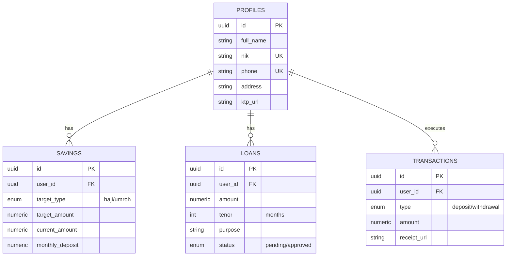
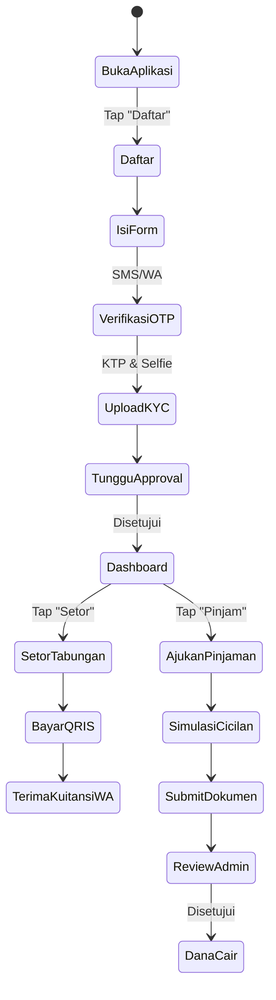

# Spesifikasi Proyek ASLABAR-FINANCE

Dokumen ini berisi spesifikasi lengkap, rancangan arsitektur, dan kebutuhan bisnis untuk aplikasi web manajemen tabungan haji/umroh serta layanan simpan-pinjam.

## 1. Wireframe & UI/UX Design (Representasi Tekstual)
*Catatan: Desain Figma lengkap perlu dibuat oleh tim UI/UX berdasarkan deskripsi berikut.*

**Prinsip Desain:** Antarmuka Ramah Lansia (Teks besar, Icon berlabel jelas, Kontras warna tinggi, Flow 1-arah).
**Layar Utama (10 Screen):**
1. **Splash Screen / Onboarding:** Logo besar, tombol "Masuk" dan "Daftar Baru".
2. **Login / Register:** Input No. HP, Request OTP, Form NIK & Nama.
3. **Upload Dokumen (e-KYC):** Panduan foto KTP (bingkai panduan) & foto Selfie.
4. **Dashboard Utama:** Saldo Tabungan (Angka besar), Progress Bar visual target haji/umroh, Tombol Aksi Cepat ("Setor", "Pinjam").
5. **Setor Dana:** Input Nominal (dengan pilihan cepat Rp 100rb, Rp 500rb, dll), Pilih Metode Bayar (QRIS, VA).
6. **Kuitansi Digital:** Ringkasan sukses, tombol "Bagikan ke WhatsApp", tombol "Unduh PDF".
7. **Pengajuan Pinjaman (Simulasi):** Slider rentang nominal, Dropdown Tenor, Tampilan cicilan per bulan.
8. **Form Pengajuan Pinjaman:** Upload dokumen jaminan/syarat, Tujuan pinjaman.
9. **Histori Transaksi:** Daftar riwayat (Setor, Tarik, Pinjam) dengan filter bulan.
10. **Notifikasi / Reminder:** List pemberitahuan jadwal setoran & status approval pinjaman.

## 2. Technical Architecture Diagram

```mermaid
graph TD
    Client[Client Mobile/Web App] -->|HTTPS/REST/GraphQL| API[API Gateway / Load Balancer]
    
    subgraph Cloud Infrastructure (AWS/GCP)
        API --> Auth[Auth Service - Supabase]
        API --> Core[Core App Service - Node.js/Vite]
        API --> Notification[Notification Service - Message Queue]
        
        Auth --> DB[(PostgreSQL)]
        Core --> DB
        Core --> Cache[(Redis)]
        Core --> Storage[(S3 / Supabase Storage)]
        
        Notification --> WhatsApp[WhatsApp Business API]
        Notification --> SMS[SMS Gateway]
        
        Core --> PaymentGateway[Payment Gateway - Midtrans/Xendit]
    end
```

## 3. Database Schema (ERD)



## 4. API Documentation (OpenAPI / Swagger Outline)

- `POST /api/v1/auth/otp/request` - Request OTP via WhatsApp/SMS
- `POST /api/v1/auth/otp/verify` - Verifikasi OTP
- `POST /api/v1/users/kyc` - Upload dokumen e-KYC (KTP & Selfie)
- `GET /api/v1/savings` - Get saldo tabungan & progress
- `POST /api/v1/savings/deposit` - Inisiasi setoran (Generate QRIS/VA)
- `POST /api/v1/loans/simulate` - Hitung simulasi cicilan pinjaman
- `POST /api/v1/loans/apply` - Ajukan pinjaman
- `GET /api/v1/transactions` - List histori transaksi dengan filter

## 5. User Flow Diagram



## 6. Business Requirement Document (BRD)

- **Latar Belakang:** Kebutuhan masyarakat (khususnya lansia) akan platform terpercaya untuk menabung persiapan haji/umroh yang transparan, mudah digunakan, dan diawasi OJK.
- **Tujuan Bisnis:** Mengakuisisi 10.000 nasabah dalam 1 tahun pertama dengan total AUM (Asset Under Management) Rp 10 Miliar.
- **Fitur Utama Bisnis:** Tabungan Haji/Umroh Auto-debit, Pinjaman Syariah/Konvensional, Sistem Reminder via WA, Kuitansi Digital.
- **Compliance:** Enkripsi data AES-256, server di Indonesia (PDP), kepatuhan regulasi OJK & DSN MUI (jika syariah).

## 7. Project Roadmap

- **Fase 1: MVP (Bulan 1 - 3)**
  - Setup core infrastructure (Supabase, Vercel).
  - Modul Pendaftaran, e-KYC sederhana, dan Login OTP.
  - Modul Tabungan (Setoran manual via Payment Gateway).
  - Integrasi dasar WhatsApp API untuk Notifikasi.
- **Fase 2: Scaling & Loan Features (Bulan 4 - 6)**
  - Rilis modul Pengajuan Pinjaman & Simulasi.
  - Dashboard Admin/Backoffice untuk approval.
  - Optimasi Redis caching & Load Balancing.
  - Fitur Auto-Debit bulanan.
- **Fase 3: Feature Complete (Bulan 7 - 9)**
  - Advanced Analytics untuk nasabah & admin.
  - Mobile Apps native (Flutter).
  - Ekspor pelaporan PDF/Excel otomatis.
  - Program Referral.

## 8. Risk Assessment & Mitigation Plan

| Risiko | Dampak | Probabilitas | Mitigasi |
|--------|--------|--------------|----------|
| **Kebocoran Data KYC** | Tinggi | Rendah | Implementasi AES-256, private bucket storage dengan RLS ketat, audit keamanan bulanan. |
| **Downtime Payment Gateway** | Sedang | Sedang | Integrasi multi-payment gateway (fallback). |
| **Adopsi User Lansia Rendah** | Tinggi | Tinggi | Desain UI super sederhana, sosialisasi offline, dan fitur bantuan CS via WhatsApp. |
| **Gagal Bayar Pinjaman** | Tinggi | Sedang | Proses credit scoring ketat, wajib jaminan, integrasi SLIK OJK. |
